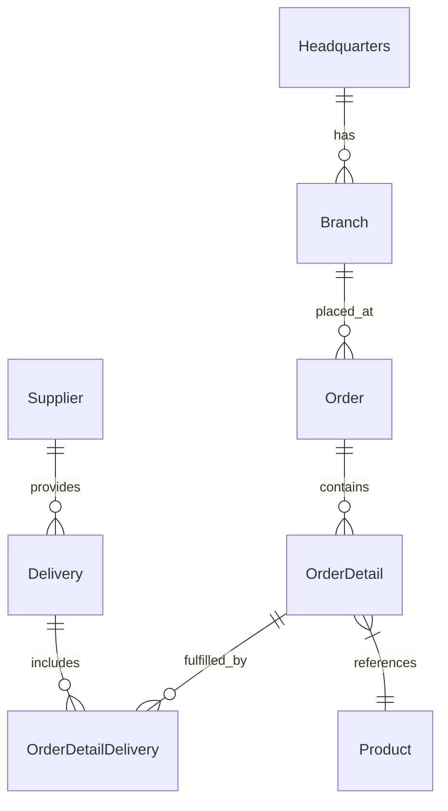

# 🚀 OctoCAT Supply


Welcome to **OctoCAT Supply** — your premier destination for AI-powered smart products designed specifically for your feline companions! 🐱🤖 This sample repository showcases a full-stack ecommerce platform for our fictional company, where cutting-edge cat tech innovations bring together the latest in artificial intelligence, sensor technology, and pet-friendly design.

## 🏗️ Architecture

The application is built using modern TypeScript with a clean separation of concerns:



### Tech Stack

- **Frontend**: React 18+, TypeScript, Tailwind CSS, Vite
- **Backend**: Express.js, TypeScript, SQLite, OpenAPI/Swagger
- **Data**: SQLite (file db at `api/data/app.db`; in-memory for tests)
- **DevOps**: Docker

## 🚀 Getting Started

### Prerequisites

- Node.js 18+ and npm
- Make

### Quick Start

1. Clone this repository

2. Install dependencies:

   ```bash
   make install
   ```

3. Start the development environment:

   ```bash
   make dev
   ```

This will start both the API server (on port 3000) and the frontend development server (on port 5137).

### Available Make Commands

View all available commands:

```bash
make help
```

Key commands:

- `make dev` - Start both API and frontend development servers
- `make dev-api` - Start only the API server
- `make dev-frontend` - Start only the frontend server
- `make build` - Build both API and frontend for production
- `make db-init` - Initialize database schema
- `make db-seed` - Seed database with sample data
- `make test` - Run all unit/integration tests
- `make test-e2e` - Run Playwright end-to-end tests
- `make clean` - Clean build artifacts and dependencies

### Database Management

Initialize the database explicitly (migrations + seed):

```bash
make db-init
```

Seed data only:

```bash
make db-seed
```

Or use npm scripts directly in the API directory:

```bash
cd api && npm run db:migrate  # Run migrations only
cd api && npm run db:seed     # Seed data only
```

### VS Code Integration

You can also use VS Code tasks and launch configurations:

- `Cmd/Ctrl + Shift + P` -> `Run Task` -> `Build All`
- Use the Debug panel to run `Start API & Frontend`

## 🛠️ MCP Server Setup (Optional)

To showcase extended capabilities:

1. Install Docker/Podman for the GitHub MCP server
2. Use VS Code command palette:
   - `MCP: List servers` -> `playwright` -> `Start server`
   - `MCP: List servers` -> `github` -> `Start server`
3. Configure with a GitHub PAT (required for GitHub MCP server)

## 🧪 End-to-End Testing (Playwright)

The project uses [Playwright](https://playwright.dev) for end-to-end browser testing. Tests live under `frontend/tests/e2e/`.

### Running tests locally

1. Install dependencies (if not done already):

   ```bash
   make install
   ```

2. Install the Playwright browsers (one-time setup):

   ```bash
   cd frontend && npx playwright install chromium
   ```

3. Start the development environment and run the tests:

   ```bash
   # Option A – let Playwright start the dev servers automatically
   make test-e2e

   # Option B – start servers manually first, then run in fast mode
   make dev          # in one terminal
   cd frontend && PLAYWRIGHT_WEB_SERVER=false npm run test:e2e   # in another
   ```

### Test configuration

The Playwright config lives at `frontend/playwright.config.ts`. Key settings:

| Setting | Value |
|---------|-------|
| Base URL | `http://localhost:5137` (override with `PLAYWRIGHT_BASE_URL`) |
| Web server auto-start | enabled by default; set `PLAYWRIGHT_WEB_SERVER=false` to skip |
| Browsers | Chromium, Edge |
| Test directory | `frontend/tests/e2e/` |
| Traces / screenshots | captured on first retry / on failure |

### Running in CI

The CI workflow runs `make test-e2e`, which automatically starts the full dev stack (API + frontend) before executing tests. Ensure the following secrets/env vars are available if required by downstream steps:

- `PLAYWRIGHT_BASE_URL` – override the base URL (optional; defaults to `http://localhost:5137`)
- `PLAYWRIGHT_WEB_SERVER` – set to `false` if the server is already running in a prior step

### Adding new tests

Place new specs under `frontend/tests/e2e/` following the `kebab-case.spec.ts` naming convention. Refer to `frontend/tests/features/` for corresponding BDD feature files that document the user journeys.

## 📚 Documentation

- [Detailed Architecture](./docs/architecture.md)
- [SQLite Integration](./docs/sqlite-integration.md)

Database defaults and env vars:

- DB file: `api/data/app.db` (override with `DB_FILE=/absolute/path/to/file.db`)
- Enable WAL: `DB_ENABLE_WAL=true` (default)
- Foreign keys: `DB_FOREIGN_KEYS=true` (default)

---

*This entire project, including the hero image, was created using AI and GitHub Copilot! Even this README was generated by Copilot using the project documentation.* 🤖✨
