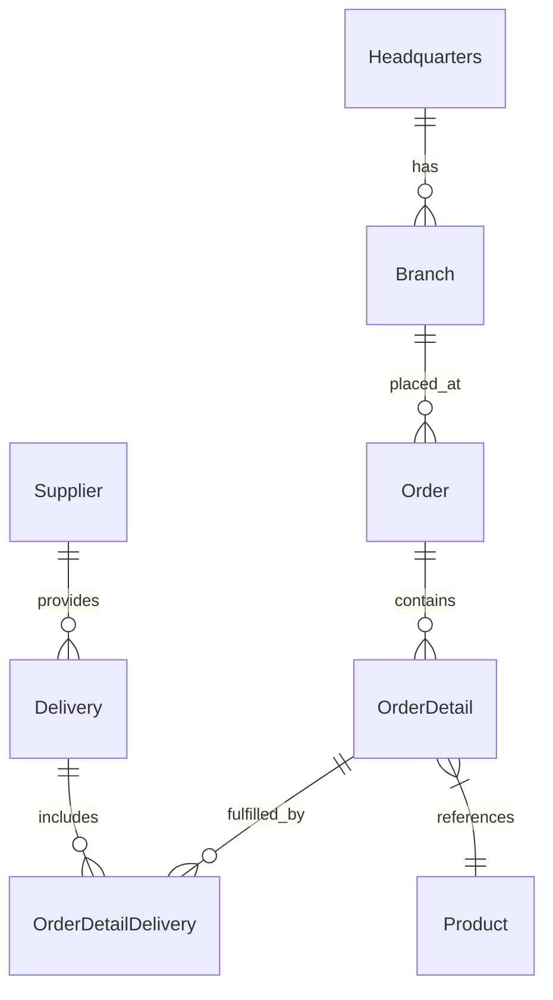

# 🚀 OctoCAT Supply


Welcome to **OctoCAT Supply** — your premier destination for AI-powered smart products designed specifically for your feline companions! 🐱🤖 This sample repository showcases a full-stack ecommerce platform for our fictional company, where cutting-edge cat tech innovations bring together the latest in artificial intelligence, sensor technology, and pet-friendly design.

## 🏗️ Architecture

The application is built using modern TypeScript with a clean separation of concerns:



### Tech Stack

- **Frontend**: React 18+, TypeScript, Tailwind CSS, Vite
- **Backend**: Express.js, TypeScript, SQLite, OpenAPI/Swagger
- **Data**: SQLite (file db at `api/data/app.db`; in-memory for tests)
- **DevOps**: Docker

## 🚀 Getting Started

### Prerequisites

- Node.js 18+ and npm
- Make

### Quick Start

1. Clone this repository

2. Install dependencies:

   ```bash
   make install
   ```

3. Start the development environment:

   ```bash
   make dev
   ```

This will start both the API server (on port 3000) and the frontend development server (on port 5173).

### Available Make Commands

View all available commands:

```bash
make help
```

Key commands:

- `make dev` - Start both API and frontend development servers
- `make dev-api` - Start only the API server
- `make dev-frontend` - Start only the frontend server
- `make build` - Build both API and frontend for production
- `make db-init` - Initialize database schema
- `make db-seed` - Seed database with sample data
- `make test` - Run all tests
- `make clean` - Clean build artifacts and dependencies

### Database Management

Initialize the database explicitly (migrations + seed):

```bash
make db-init
```

Seed data only:

```bash
make db-seed
```

Or use npm scripts directly in the API directory:

```bash
cd api && npm run db:migrate  # Run migrations only
cd api && npm run db:seed     # Seed data only
```

### VS Code Integration

You can also use VS Code tasks and launch configurations:

- `Cmd/Ctrl + Shift + P` -> `Run Task` -> `Build All`
- Use the Debug panel to run `Start API & Frontend`

## 🧪 End-to-End Testing (Playwright)

This project uses [Playwright](https://playwright.dev) for end-to-end browser testing. All test files live in `frontend/tests/`.

```
frontend/tests/
├── e2e/                   # Spec files grouped by feature
│   ├── homepage.spec.ts
│   └── product-navigation.spec.ts
├── features/              # BDD feature files (Gherkin)
│   └── product-navigation.feature
├── fixtures/              # Shared Playwright fixtures
│   └── test-fixtures.ts
└── pages/                 # Page Object Models
    ├── HomePage.ts
    └── ProductsPage.ts
```

### Prerequisites

Install Playwright browser binaries (first time only):

```bash
cd frontend
npx playwright install chromium
```

### Running Tests Locally

> Both the API (port 3000) and the frontend dev server (port 5137) must be running.  
> Start them with `make dev` in the root, or run each separately:
> - `make dev-api` (API on port 3000)
> - `make dev-frontend` (frontend on port 5137)

```bash
# Run all E2E tests (auto-starts the dev servers via webServer config)
make test-e2e

# Or run directly from the frontend directory
cd frontend
npm run test:e2e

# Run against already-running servers (skip the webServer launcher)
cd frontend
PLAYWRIGHT_WEB_SERVER=false npx playwright test

# Run a specific spec file
cd frontend
PLAYWRIGHT_WEB_SERVER=false npx playwright test tests/e2e/homepage.spec.ts

# Run only on Chromium
cd frontend
PLAYWRIGHT_WEB_SERVER=false npx playwright test --project=chromium

# Interactive UI mode (great for debugging)
cd frontend
PLAYWRIGHT_WEB_SERVER=false npx playwright test --ui

# Show the HTML report after a run
cd frontend
npx playwright show-report
```

### Running Tests in CI

Set the environment variables before running:

| Variable | Default | Description |
|---|---|---|
| `PLAYWRIGHT_BASE_URL` | `http://localhost:5137` | Base URL of the running frontend |
| `PLAYWRIGHT_WEB_SERVER` | _(unset)_ | Set to `false` to skip the auto-started dev server |

Example CI step (GitHub Actions):

```yaml
- name: Install dependencies
  run: make install

- name: Build
  run: make build

- name: Install Playwright browsers
  run: cd frontend && npx playwright install --with-deps chromium

- name: Start servers
  run: make dev &

- name: Run E2E tests
  run: make test-e2e
```

### Test Artifacts

After a run, Playwright writes artifacts to `frontend/test-results/` (gitignored) and an HTML report to `frontend/playwright-report/` (gitignored). Open the report with:

```bash
cd frontend && npx playwright show-report
```

## 🛠️ MCP Server Setup (Optional)

To showcase extended capabilities:

1. Install Docker/Podman for the GitHub MCP server
2. Use VS Code command palette:
   - `MCP: List servers` -> `playwright` -> `Start server`
   - `MCP: List servers` -> `github` -> `Start server`
3. Configure with a GitHub PAT (required for GitHub MCP server)

## 📚 Documentation

- [Detailed Architecture](./docs/architecture.md)
- [SQLite Integration](./docs/sqlite-integration.md)

Database defaults and env vars:

- DB file: `api/data/app.db` (override with `DB_FILE=/absolute/path/to/file.db`)
- Enable WAL: `DB_ENABLE_WAL=true` (default)
- Foreign keys: `DB_FOREIGN_KEYS=true` (default)

---

*This entire project, including the hero image, was created using AI and GitHub Copilot! Even this README was generated by Copilot using the project documentation.* 🤖✨
